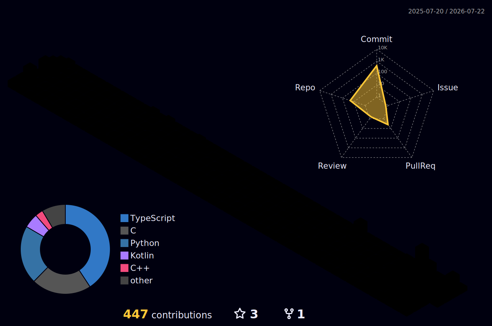
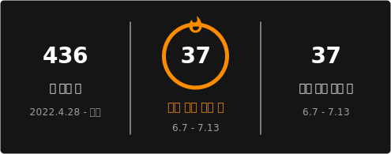

---

## 🛠 Tech Stack

**Languages**

**System / Network**

**Embedded / Mobile**

**Tools**

---

## 🟦 Voxel Contribution Graph

<picture>
  <source media="(prefers-color-scheme: dark)" srcset="./profile-3d-contrib/profile-night-rainbow.svg">
  <source media="(prefers-color-scheme: light)" srcset="./profile-3d-contrib/profile-gitblock.svg">
  
</picture>

---

<!-- STREAK_START -->
## 🔥 Commit Streak

> 매일 커밋하면 스트릭이 쌓여요!

| | |
|---|---|
| 현재 스트릭 | **0일** |
| 최장 스트릭 | **0일** |

<!-- STREAK_END -->
